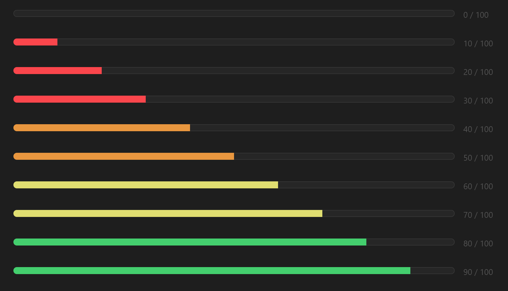

# obsidian-dataview-folder-task-progress

A consolidated progress bar displaying the completion status of all tasks across every note in a designated folder using Obsidian's Dataview plugin.



## Installation

1. Copy the script into your Obsidian vault.
2. Replace `"relative/path/to/your/folder"` with the path to your target folder.
3. Add the script to a DataviewJS block in your Obsidian note.

To include notes with fully completed tasks, update the condition as shown below to ensure all tasks are considered, including those in notes with fully completed tasks:

Replace this line:

```dataviewjs
if (totalTasks > completedTasks) {
```

With this line:

```dataviewjs
if (totalTasks >= completedTasks) {
```
